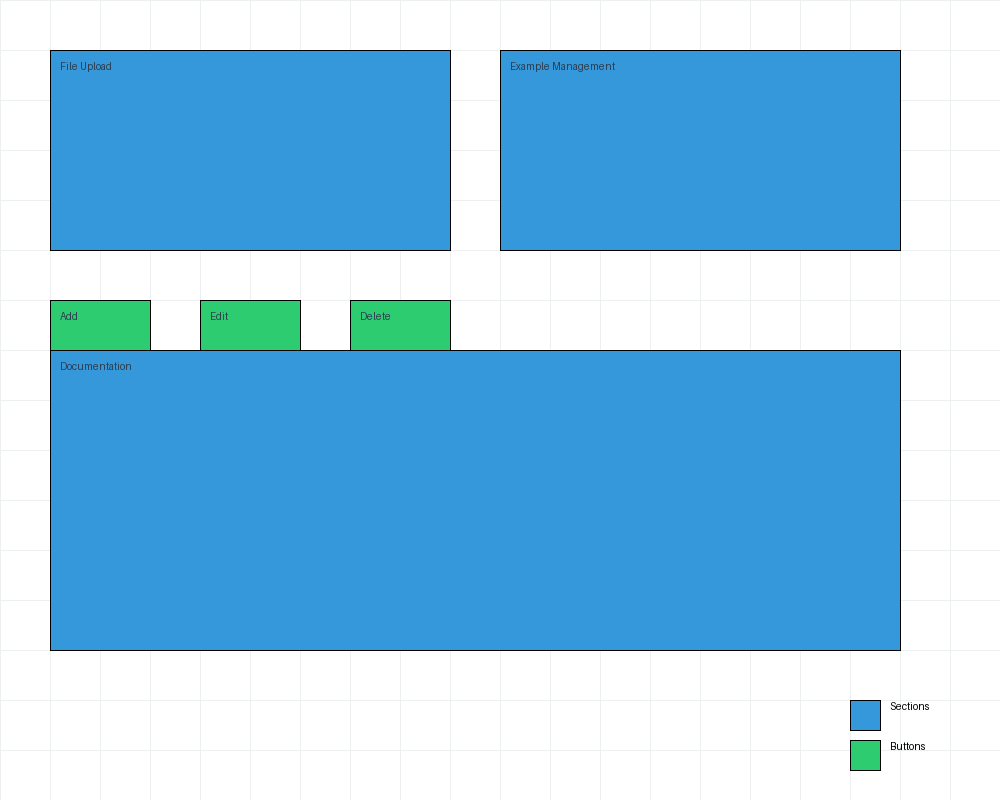

# Functional Specifications for FPGA Simulation Web Application

## 1. Introduction

### 1.1 Purpose
The purpose of this document is to provide a comprehensive functional specification for a web-based FPGA simulation application. This application aims to simulate FPGA circuits using Verilog applications and testbenches, allowing users to visualize the components, their connections, and the propagation of electrical signals.

### 1.2 Scope
This document covers the following aspects:
- User roles and interactions
- Simulation controls and visualization
- Performance and scalability considerations
- Error handling and validation
- Documentation and examples
- Integration and compatibility
- Security and compliance

### 1.3 Definitions, Acronyms, and Abbreviations
- **FPGA**: Field-Programmable Gate Array
- **BEL**: Basic Element
- **SDF**: Standard Delay Format
- **P&R**: Place and Route
- **GUI**: Graphical User Interface
- **API**: Application Programming Interface

### 1.4 References
- [Readme.md](https://github.com/LeFl0w/ALGOSUP_POC/blob/main/Readme.md)
- [SDF.md](https://github.com/LeFl0w/ALGOSUP_POC/blob/main/Doc/SDF.md)

### 1.5 Overview
The application will provide a web interface for teachers to upload Verilog applications and testbenches, and for students to select and simulate these applications. The simulation will display a 2D view of the FPGA layout, including BELs and signal routes, with controls to adjust the speed of signal propagation and clock speed.

## 2. User Roles and Interactions

### 2.1 Teacher Role
- **Upload Applications**: Teachers can upload Verilog applications and associated testbenches to the server.
- **Manage Examples**: Teachers can add, edit, and delete application examples.
- **Documentation**: Teachers can provide How-To documents explaining how to run the software and add application examples.

### 2.2 Student Role
- **Select Applications**: Students can select from preloaded application examples.
- **Simulate Applications**: Students can run the selected applications and visualize the signal propagation.
- **Control Simulation**: Students can adjust the speed of signal propagation and clock speed, and use play, pause, step, and resume buttons.

## 3. Simulation Controls and Visualization

### 3.1 Simulation Controls
- **Play/Pause/Resume**: Buttons to start, pause, and resume the simulation.
- **Step**: Button to advance the simulation one step at a time.
- **Speed Control**: Slider or input field to adjust the speed of signal propagation (e.g., x1, x2, x4).
- **Clock Speed**: Slider or input field to adjust the speed of the clock.

### 3.2 Visualization
- **2D View**: A 2D representation of the FPGA layout, including BELs and signal routes.
- **Navigation**: Zoom and move functionality to navigate within the 2D view.
- **Layers**: Optional layers for the clock and components to enhance visualization.
- **Realistic Display**: Components and electrical paths should be positioned in an organized and clear manner, balancing realism with simplicity.

*Figure 1: Example of FPGA Layout Visualization*

## 4. Performance and Scalability

### 4.1 Performance Requirements
- **Responsiveness**: The application should be responsive and performant on any standard machine.
- **Smooth Simulation**: Simulations should run smoothly with minimal lag.
- **Concurrency**: The system should support multiple concurrent users without significant performance degradation.

### 4.2 Scalability
- **Future Enhancements**: The application should be designed with scalability in mind to support future enhancements and increased user load.
- **Cross-Platform Compatibility**: Ensure the application is cross-platform compatible, with no installation required for users.

## 5. Error Handling and Validation

### 5.1 Error Handling
- **User Notification**: Inform users of any errors in a simple and clear manner, explaining what went wrong and the expected behavior.
- **File Validation**: Ensure that uploaded Verilog and SDF files are not empty. Detailed validation of file contents is not required.
- **Error Messages**: Provide clear and concise error messages for common issues, such as file upload failures or simulation errors.

### 5.2 Validation
- **File Checks**: Basic checks to ensure files are not empty.
- **User Feedback**: Prompt users to verify the correctness of their files if an error occurs.

## 6. Documentation and Examples

### 6.1 How-To Documents
- **Running the Software**: Detailed instructions on how to run the software.
- **Adding Application Examples**: Step-by-step guide on how to add new application examples.

### 6.2 Application Examples
- **Minimum Requirements**: At least two application examples, one for a flip-flop and another for a LUT4.
- **Documentation**: Each example should include necessary documentation and comments.
- **Example Folder**: Collect examples of netlist schematics and SDF files in the `Example` folder.

## 7. Integration and Compatibility

### 7.1 Navigation
- **Convenient Navigation**: Ensure the simulation interface is easy to navigate, with clear controls and visualization.
- **User Flow**: Provide a clear user flow for both teachers and students, with intuitive navigation and controls.

### 7.2 File Assumptions
- **Correct Files**: Assume that the uploaded Verilog and SDF files are correct and do not require detailed validation.
- **File Parsing**: Implement a program to interpret complex Verilog and SDF files, prune unnecessary information, and create a simplified file containing components, connections, and delay information.

## 8. Security and Compliance

### 8.1 Educational Content
- **No Sensitive Data**: The application is for educational purposes and does not handle sensitive data.
- **Data Privacy**: Ensure that user data is handled in compliance with educational standards and data privacy regulations.

### 8.2 Additional Features
- **Screenshot**: Ability to take screenshots of the simulation.
- **Backup**: Optional backup feature to save simulation states.
- **Logging**: Logging is not required but can be implemented if needed to keep track of previous work.
- **Auditing**: Implement basic auditing features to track user actions and ensure accountability.

## 9. Visualization Challenge

### 9.1 Component Display
- **Organized Layout**: Ensure components and electrical paths are positioned in an organized and clear manner.
- **Realistic and Simplified**: Balance realism with simplicity to provide an appealing and easy-to-read simulation.
- **Visualization Details**: Provide detailed visualization of BELs, signal routes, and timing propagation delays.

*Figure 2: Example of Component Display*

## 10. Technical Details

### 10.1 Programming Language
- **Web Interface**: The software must be accessible through a web interface. The technology used to develop the application is open.
- **Backend**: Implement the backend using a robust and scalable framework, such as Node.js or Django.
- **Frontend**: Use modern web technologies, such as React or Vue.js, for the frontend.

### 10.2 Data Formats
- **Netlist Schematic**: Use Verilog format for the netlist schematic.
- **Standard Delay File**: Use SDF format for timing propagation delays.

### 10.3 Synthesis and P&R
- **Synthesis Tool**: Use `Impulse` or `yosys` for synthesis.
- **P&R Tool**: Ensure the P&R tool is compatible with the synthesis output and generates the necessary netlist and SDF files.

## 11. User Interface Design

### 11.1 Teacher Interface
- **File Upload**: Provide a user-friendly interface for teachers to upload Verilog applications and testbenches.
- **Example Management**: Allow teachers to manage application examples with options to add, edit, and delete.
- **Documentation**: Include a section for teachers to provide How-To documents and additional resources.

*Figure 3: Teacher Interface for File Upload and Example Management*

### 11.2 Student Interface
- **Application Selection**: Provide a clear and intuitive interface for students to select preloaded application examples.
- **Simulation Controls**: Include play, pause, step, and resume buttons, along with speed control sliders.
- **Visualization**: Display a 2D view of the FPGA layout with zoom and move functionality.
- **Error Handling**: Provide clear error messages and guidance for students if something goes wrong.

*Figure 4: Student Interface for Simulation Controls and Visualization*

## 12. Testing and Quality Assurance

### 12.1 Test Cases
- **Functional Testing**: Ensure all functionalities are thoroughly tested, including file upload, simulation controls, and visualization.
- **Performance Testing**: Test the application under various load conditions to ensure responsiveness and scalability.
- **Usability Testing**: Conduct usability testing to ensure the interface is intuitive and easy to use for both teachers and students.

### 12.2 Quality Assurance
- **Code Reviews**: Implement regular code reviews to ensure code quality and adherence to best practices.
- **Automated Testing**: Use automated testing tools to continuously test the application and identify any issues.
- **User Feedback**: Collect and analyze user feedback to identify areas for improvement and make necessary adjustments.

## 13. Deployment and Maintenance

### 13.1 Deployment
- **Continuous Integration/Continuous Deployment (CI/CD)**: Implement CI/CD pipelines to automate the deployment process.
- **Version Control**: Use a version control system, such as Git, to manage the source code and track changes.
- **Documentation**: Provide comprehensive documentation for deployment and maintenance procedures.

### 13.2 Maintenance
- **Regular Updates**: Ensure the application is regularly updated to address any bugs, security vulnerabilities, and performance issues.
- **User Support**: Provide user support to assist teachers and students with any issues they encounter.
- **Backup and Recovery**: Implement backup and recovery procedures to ensure data integrity and availability.

## 14. Future Enhancements

### 14.1 Additional Features
- **Advanced Visualization**: Implement advanced visualization features, such as 3D views and animated signal propagation.
- **Collaboration Tools**: Add collaboration tools to allow teachers and students to work together on simulations.
- **Integration with Other Tools**: Integrate with other educational tools and platforms to enhance the learning experience.

### 14.2 Scalability
- **Load Balancing**: Implement load balancing to distribute the workload evenly across servers.
- **Horizontal Scaling**: Design the application to support horizontal scaling, allowing for the addition of more servers as needed.
